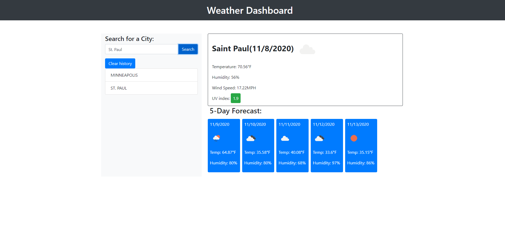

# weather-dashboard

## Overview

This repository is a weather forecast app that upon the search of a city gives you the current date and weather of the city and the forecast of the next 5 days. Weather includes temperature, humidity, wind speed, and UV index. Cities searched are placed into a search history list and when a previous city is clicked it is loaded into the current weather spot. 

## Installation

* Visit https://github.com/bo-stevenson/weather-dashboard

* Clone the repository with Git Bash(Windows) or Terminal(Mac) in directory of your choosing. 
    $ git clone git@github.com:bo-stevenson/weather-dashboard.git 

## Usage

* Click into the search bar and enter a known city.

* City will be saved into search history and appear in the current weather spot showing today's date.

* Current weather conditions will be shown as well as the forecast for the next 5 days.

* UV Index is giving a badge color depending on the severity. Green is favorable, yellow is moderate, red is severe. 

* Previous searches may be clicked to load the data of that particular city. 

## Example

Project can be viewed at https://bo-stevenson.github.io/weather-dashboard/ 

## Credits

Bo Stevenson: https://github.com/bo-stevenson 
OpenWeather API: https://openweathermap.org/api
## License 
MIT License

Copyright (c) [2020] [BoStevenson]

Permission is hereby granted, free of charge, to any person obtaining a copy
of this software and associated documentation files (the "Software"), to deal
in the Software without restriction, including without limitation the rights
to use, copy, modify, merge, publish, distribute, sublicense, and/or sell
copies of the Software, and to permit persons to whom the Software is
furnished to do so, subject to the following conditions:

The above copyright notice and this permission notice shall be included in all
copies or substantial portions of the Software.

THE SOFTWARE IS PROVIDED "AS IS", WITHOUT WARRANTY OF ANY KIND, EXPRESS OR
IMPLIED, INCLUDING BUT NOT LIMITED TO THE WARRANTIES OF MERCHANTABILITY,
FITNESS FOR A PARTICULAR PURPOSE AND NONINFRINGEMENT. IN NO EVENT SHALL THE
AUTHORS OR COPYRIGHT HOLDERS BE LIABLE FOR ANY CLAIM, DAMAGES OR OTHER
LIABILITY, WHETHER IN AN ACTION OF CONTRACT, TORT OR OTHERWISE, ARISING FROM,
OUT OF OR IN CONNECTION WITH THE SOFTWARE OR THE USE OR OTHER DEALINGS IN THE
SOFTWARE.   